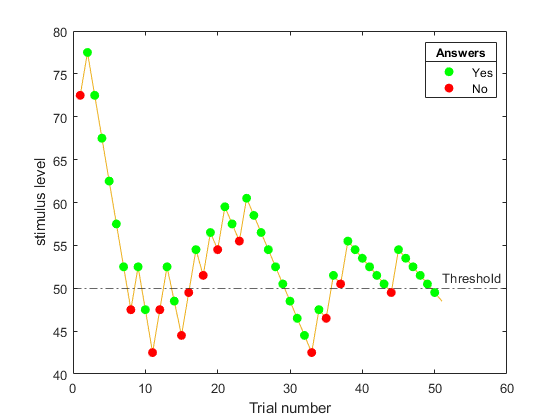

# AHALAB_SAS

`AHALAB_SAS` is a class for running a Stochastic Approximation Staircase (SAS) procedure. SAS is a method for estimating the threshold of a stimulus based on a binary response (e.g., correct/incorrect). It is a sequential procedure that converges to the threshold of a stimulus by adjusting the stimulus intensity based on the response of the observer for the previous stimuli.

<p align="center">

</p>

### Default Update Equation

The default update equation to update the stimulus values for is:

$$ x_{n+1} =  x_{n} - \frac{c}{m+1}(Z_{n} - \phi) $$

Where:
- $`x_{n}`$ is the amplitude of the stimulation during the previous trial.
- $`z_{n}`$ (response) is set to 1 if the participant perceived a sensation (i.e., responded ‘Yes’) or 0 if there was no sensation (i.e., responded ‘No’).
- $`m`$ is the number of reversals (how many times the answer switches from ‘Yes’ to ‘No’ and vice versa).
- $`\phi`$ is the target threshold probability. (between 0-1)
- $`c`$ is a suitable constant.
  
### Typical use:
```matlab
Phi = 0.85;
c = 30;
x_1 = 100; % this is the first simulation value. 

% create a sas object that stops after 10 trials 
sas = AHALAB_SAS(Phi, c, x_1, 'minStepSizeDown', 5, 'minStepSizeUp', 5,'stopCriterion','trials','stopRule',10);

while(~sas.stop)
  % sendStimulus(sas.xCurrent);
  % z_n = getResponse();
  % sas.update(z_n);
end
```

## Methods:

- `reset()` Reset the object to the initial state.
- `update(bool z_n)` Update the object with the response of the observer.
- `setUpdateFunction(function f)` Change the Default equation used in the object to f. check below for some imporatant considerations.
- `backspace(n)` removes the last `n` responses steps from the object. (defualt = 1)
  
### example use:
```matlab
sas = AHALAB_SAS(Phi, c, x_1); % create the object.
sas.update(true); % first response is yes.
sas.update(true); % second response is also yes.
sas.backstep();  % remove the second response
sas.update(true); % change it to true.
```

## optional arguments:
When creating the object these arguments can be set to suitable values for the experiment appartus.
Optional Arguments:
- `'stopCriterion'`: Stop criterion can be set to either `'trials'` (default) or `'reversals'`.
- `'stopRule'`: Stop rule (default: `50`). i.e, the default behaviour is to stop on after 50 responses.
- `'xMax'`: Maximum possible stimulation value (default: `inf`).
- `'xMin'`: Minimum possible stimulation value (default: `-inf`).
- `'minStepSizeDown'`: Lower bound for step size (default: `-inf`).
- `'minStepSizeUp'`: Upper bound for step size (default: `inf`).
- `'truncate'` :
    - The sent stimulus `x` is **always** limited to the range `[xMax,xMin]`.
    - The algorithm updates on values stored in `xStaricase` not `x`.
    - if truncate is `true` (default):
        - `x` and `xStaircase` are equal.
    - if truncate is `false`:
        - `x` is limited to `[xMax,xMin]`.
        - `xStaircase` is **not** limited to `[xMax,xMin]`.

### example:

```matlab
sas = AHALAB_SAS(Phi, c, x_1, 'minStepSizeDown', 5, 'minStepSizeUp', 5);
```

## Outputs:
- `m`: Number of reversals.
- `x`: Actual values sent.
- `xStaircase`: Staircase values.
- `reversals`: Binary array indicating reversals.
- `responses`: Binary array indicating responses.
- `trialCount`: If stop is `false`, it is the number of the current trial. If stop is `true`, it is the number of trials run by the code.
- `stop`: Stop flag. `true` if the stop criterion is met.
- `updateFunction`: The function used to update the `x_n` value
### example:
```matlab
% plot the staircase values
plot(sas.x);
```
## Advanced:
### changing the default function:
The function must have 4 input arguments in this order `(phi, c, m, response)` 
```matlab
  custom_updateFunction = @(phi,c,m, response) c*(response-Phi)/(2+m);
   sas.setFunction(custom_updateFunction);
```
this changes the original function from $` - \frac{c}{m+1}(Z_{n} - \phi)`$ to $` - \frac{c}{m+2}(Z_{n} - \phi)`$ note the negative sign is not inserted in the `custom_updateFunction`

## Author
Created by: Waleed Alghilan, Oct-2023 (Artificial Hands Area in Scuola Superiore Sant'Anna)
